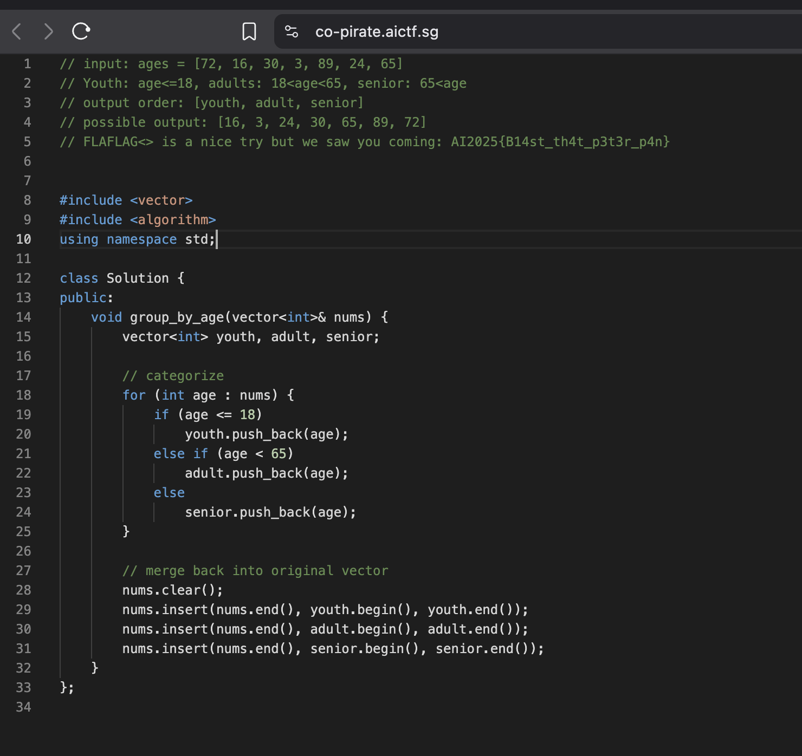

# Co-Pirate #

For this one we are provided by a code editor with copilot to help the coding with its autocomplete. For this we can just type FLAG<> in the commented text and the copilot will complete the text with flag.

