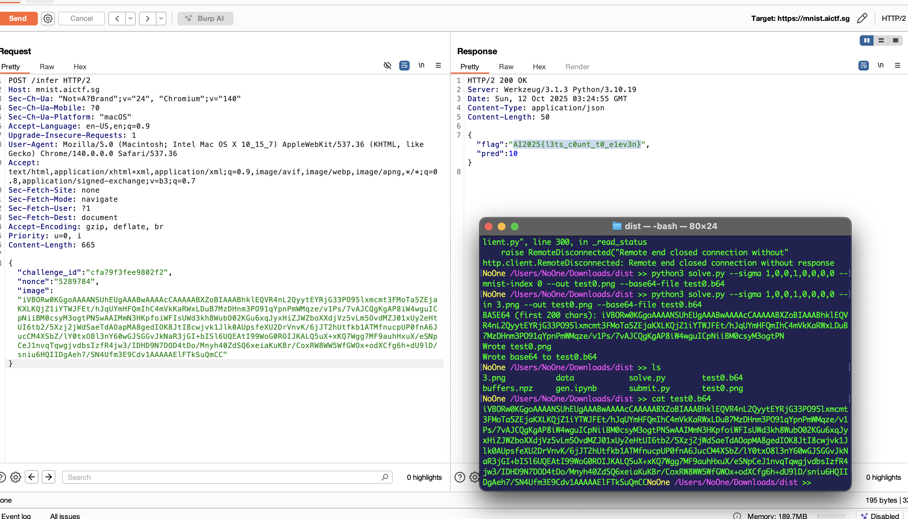

# MNIST #

For this challange, we are provided with ipynb traning script for MNIST dataset with some twist in it. There is a 'backdoor' designed by the creator if the MNIST image we supply contains some bit patterns. For this, the endpoint need 3 parameters:

1. challange_id
2. nonce
3. image

For the challange_id, we can get it using standard GET request to /challange endpoint. To count the nonce we can use the the solve_pow provided in the submit.py, providing challange and difficulty as two parameters to supply to the function. Lastly we can use the same logic in the .ipynb training script, especially the make_bit_indices and stamp_bits_into_images to convert our MNIST image so it contains 'backdoor'.

