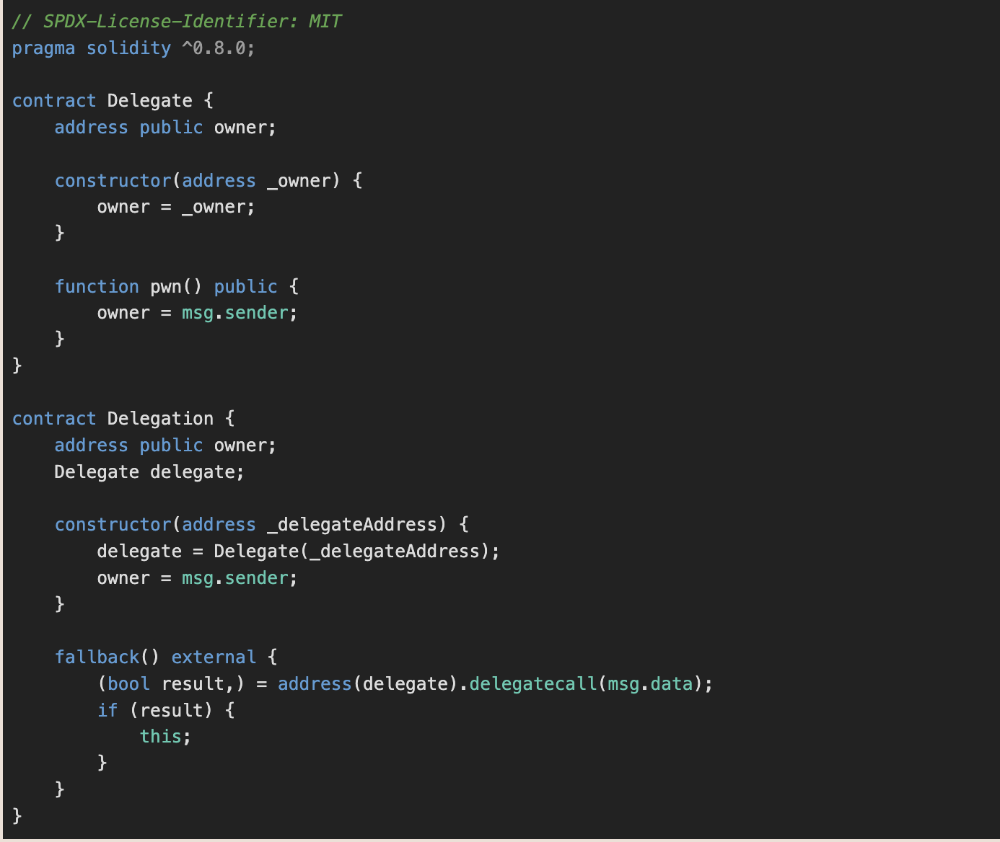
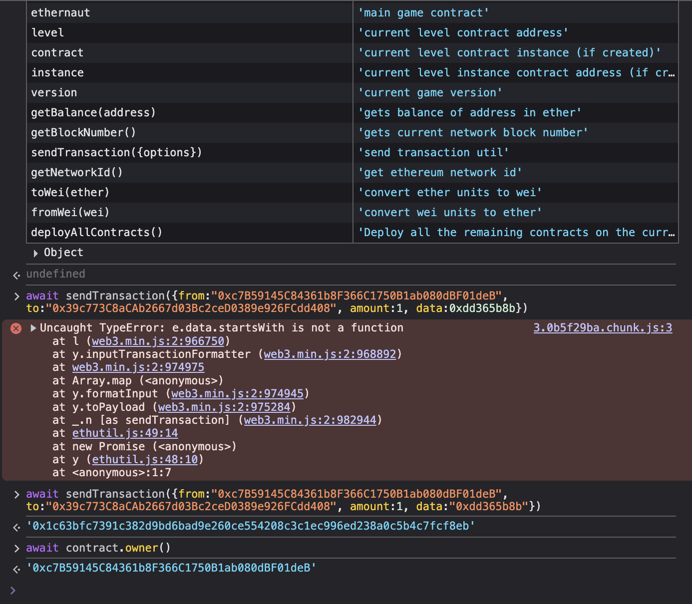

# Delegation #

### Challange ###

The goal of this level is for you to claim ownership of the instance you are given.

  Things that might help:

1. Look into Solidity's documentation on the delegatecall low level function, how it works, how it can be used to delegate operations to on-chain libraries, and what implications it has on execution scope.
2. Fallback methods
3. Method ids

Contract:



### Solution ###

Since the Delegation contract use delegateCall to the Delegate contract, the function inside the Delegate contract can be called using the Delegation context, including changing the owner. In this case, the Delegate contract has provided pwn() function that will change the owner to whoever calls it, but since the delegateCall maintain the msg.sender context, where in this case it use EOA address (user address) since we are the one that calls the Delegation contract, we can call the pwn function to change the owner address to our user address. 

Before doing that, we must know the function selector of pwn() function to call it. In this case, we can use ```cast sig``` since there is no argument needed for the function.


After that, we can use the function selector in data parameter within the transaction to the contract, since it declared the delegatecall in the fallback function.



Now the owner is changed as indicated in the above screenshot.