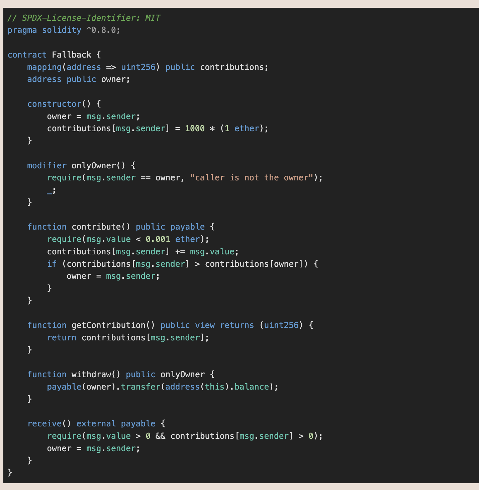
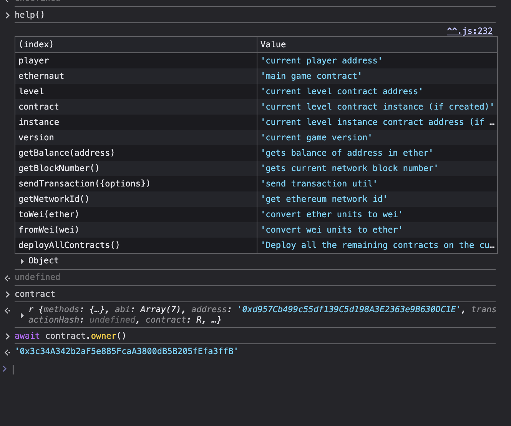
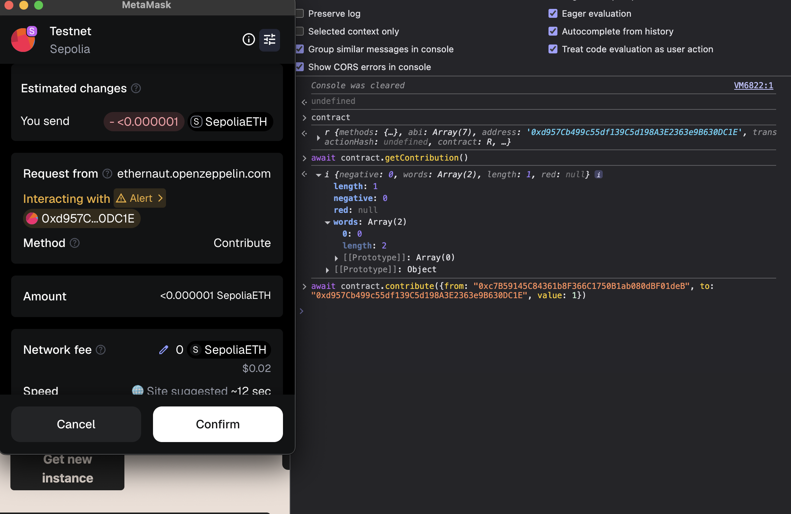
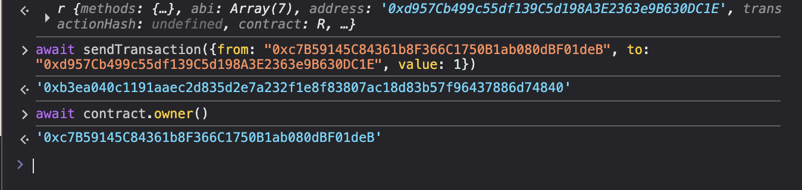
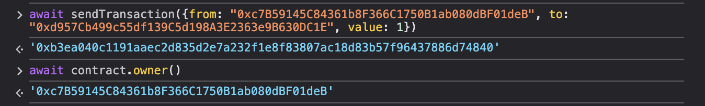
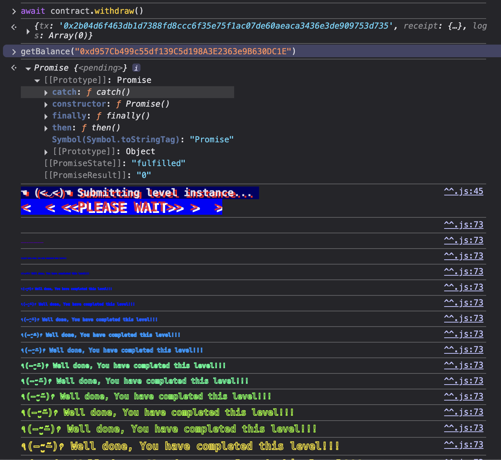

# Fallback

### Challange ###

Look carefully at the contract's code below.

You will beat this level if

    1. you claim ownership of the contract
    2. you reduce its balance to 0

### Solution ###

For this we are provided with the following smart contract:



Since the goal is to claim ownership of the contract and drain its balance, we can see two function that allow us to claim the ownership, in this case ```contribute()``` and ```receive()```. The owner of the contract can be seen in the following picture:



The ```contribute()``` function itself has check if our contribution is higher than the deployer contribution (1000 ether), which is impossible to fullfill in testnet. Also, the ```receive()``` function has this check in order to make us the owner:

```require(msg.value && contributions[msg.sender] > 0);```

Since our contributions is equal to zero, we can not use this function first. So this is the step that we will take in order to gain the ownership:

1. Use the contribute() function so that our address mapped as a contributor first (to fullfill the check above). In this case, we can use any numbers less than 0.001 ether.




2. After that, since our contribution is already > 0, use default receive() function to transfer some ether in order to take the ownership. To do this, we can simply send wei value directly to the contract since ```receive() payable``` is a default solidity function to receive funds.




3. Next, we can see that the ownership of the contract is ours by calling the ```contract.owner```. Now we can withdraw the funds to make it become 0.




