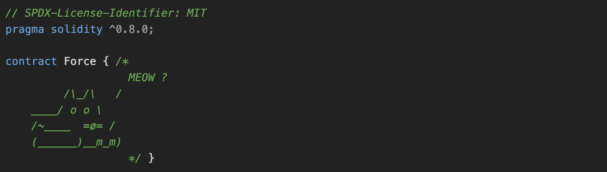

# Force #

### Contract ###



### Challange ###

Some contracts will simply not take your money ¯\_(ツ)_/¯

The goal of this level is to make the balance of the contract greater than zero.

  Things that might help:

1. Fallback methods

2. Sometimes the best way to attack a contract is with another contract.

3. See the "?" page above, section "Beyond the console"

### Solution ###

To solve this, we can check the solidity documentation (Or just ChatGPT) to find a native solidity function that can force a transaction to the target address. In this case, if we're looking at this https://solidity-by-example.org/hacks/self-destruct/:

``` selfdestruct sends all remaining Ether stored in the contract to a designated address. ```

So to solve this, we need the function that doing the selfdestruct and the contract with some balance that will get destroyed by the first contract. For this I create ForceSend.sol and ForceInteract.sol as can be seen in this repo.


For this we can deploy the contract in Remix using the same network as the one that we use to deploy the challange instance, and then assign the challange contract directly as parameter in the selfdestruct function (E.g. selfdestruct(deployedChallange)) from our exploit contract.

