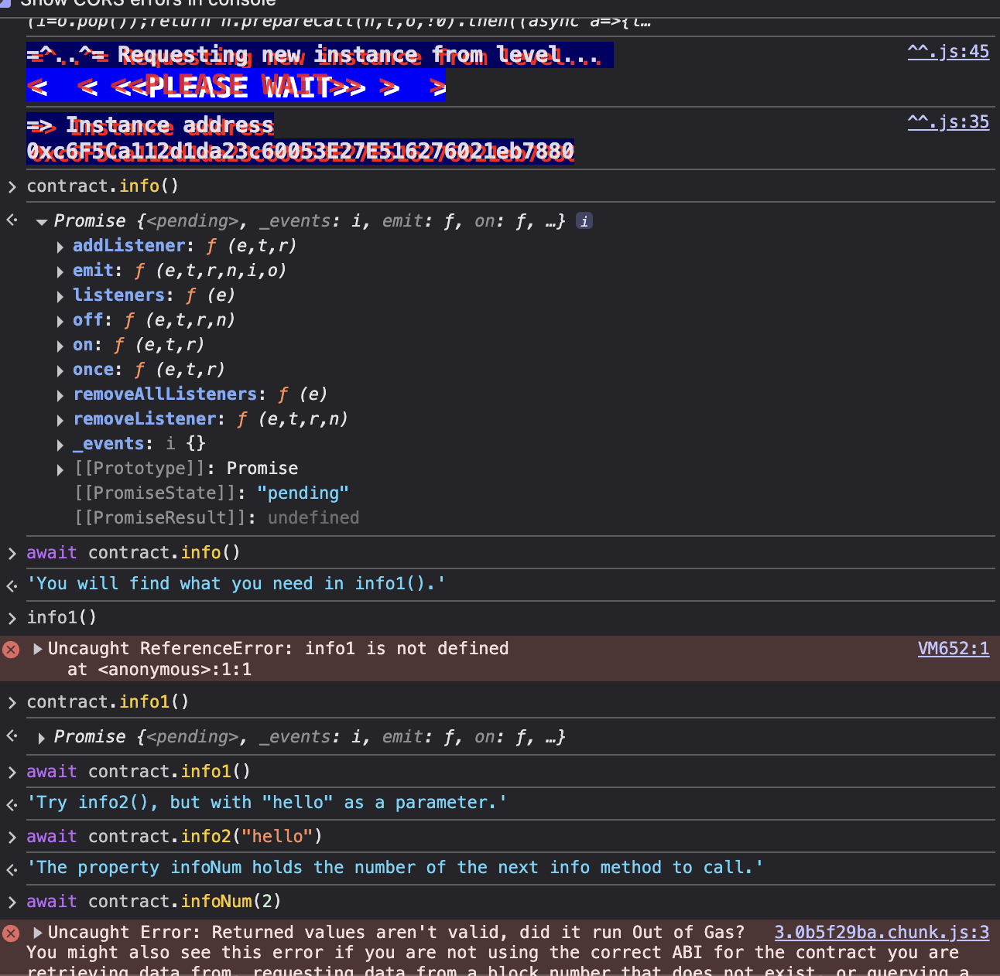
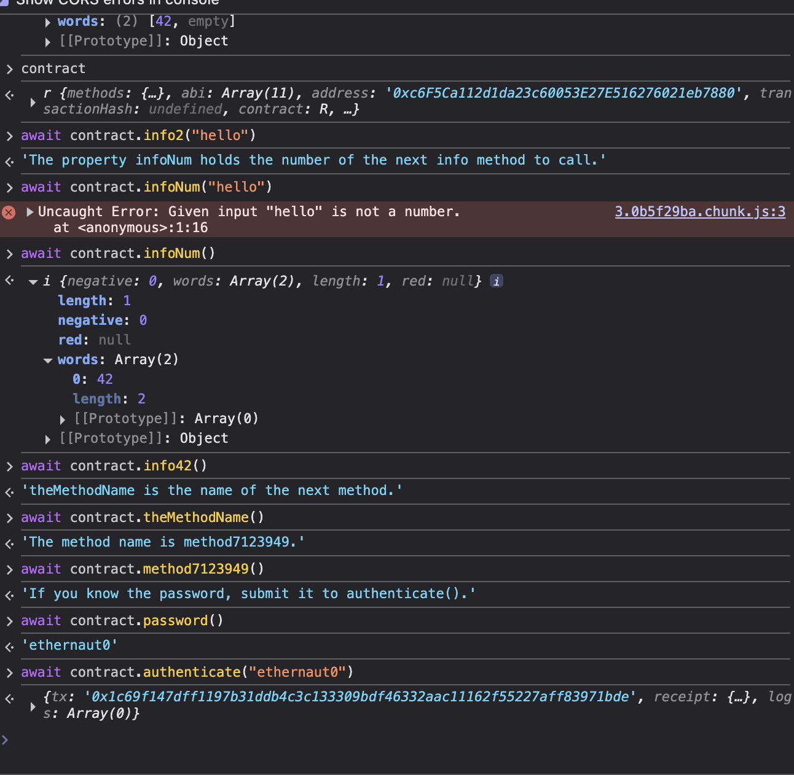

# Hello Ethernaut

This one is basically tutorial. We connect our metamask wallet and deploy the instance. After that we can interact with the on-chain contract using javascript from the developer console within our browser. 



After that we can interact using some functions, the challange is to find valid password and use it into ```contract.authenticate(password)``` function.

