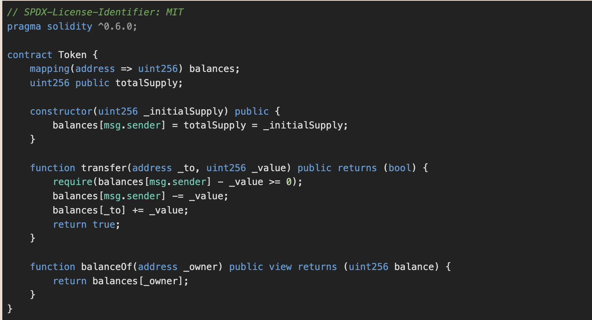
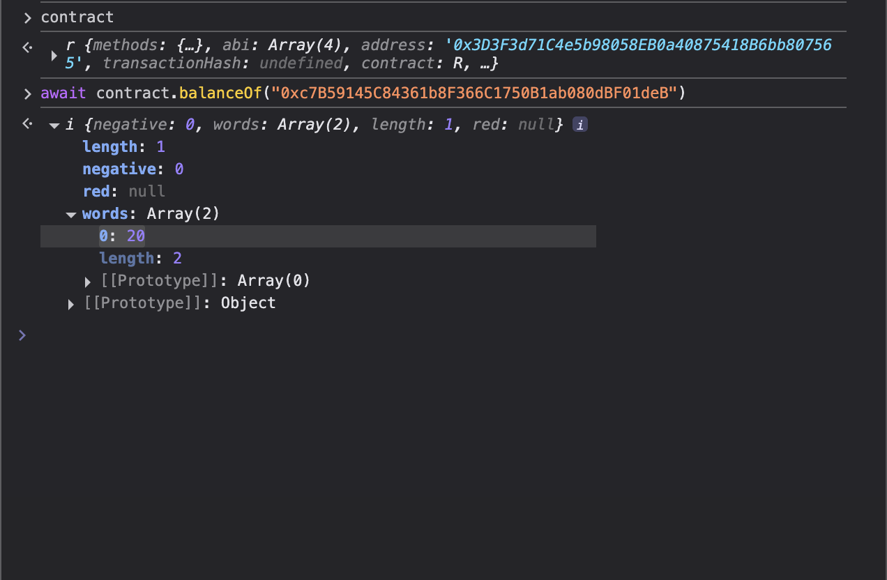
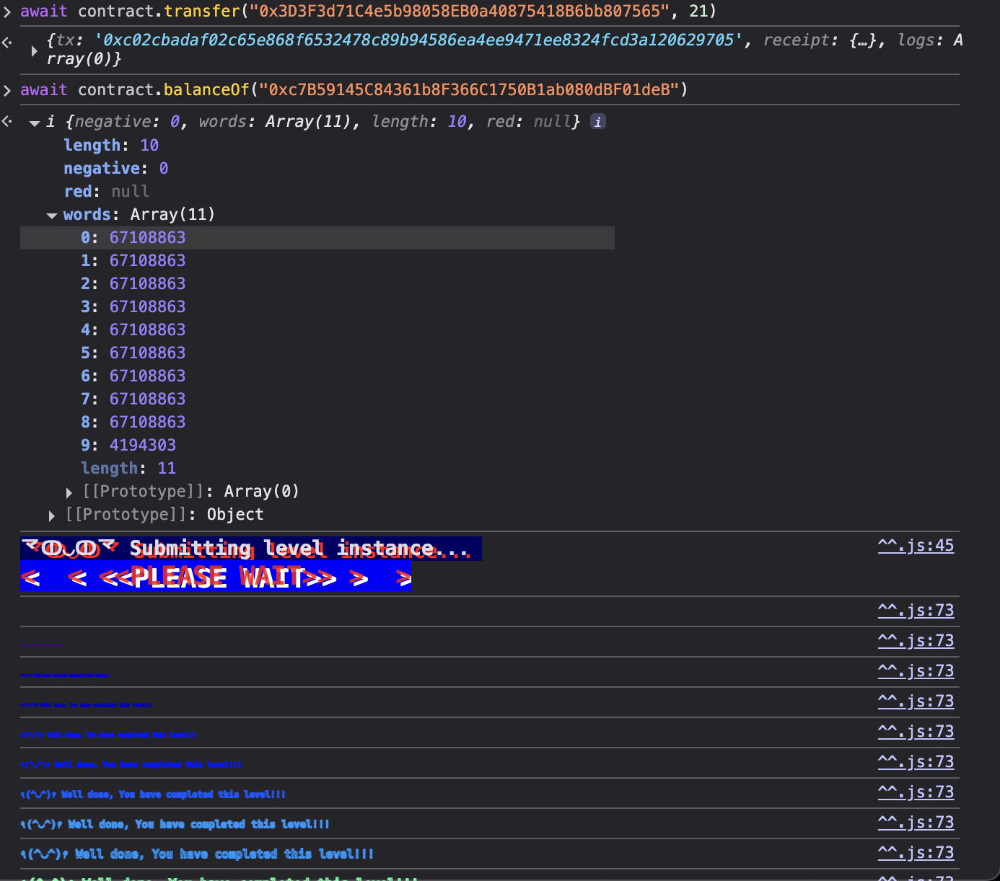

# Token #

### Challange ###

The goal of this level is for you to hack the basic token contract below.

You are given 20 tokens to start with and you will beat the level if you somehow manage to get your hands on any additional tokens. Preferably a very large amount of tokens.

### Solution ####

In this challange we are given 20 tokens and must add our token somehow.

The solution is pretty simple, we see that the smart contract is using old compiler version (0.6.0). Before 0.8.0, the arithmetic of solidity still allows for integer overflow and underflow. Here, what we can do is to transfer 21 tokens since there is also no check if the supplied value more than our balance to begin with. This cause integer underflow since 20 - 21 and the balance is uint256 (resulting in very big number).

