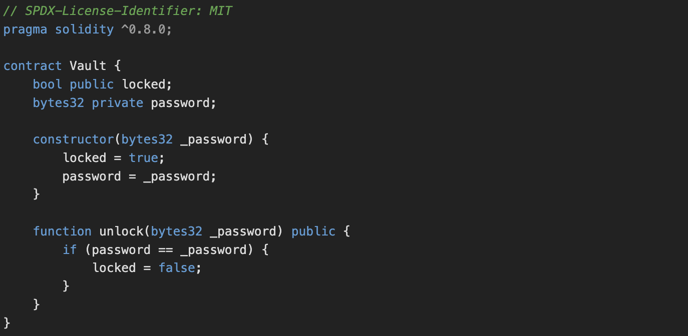
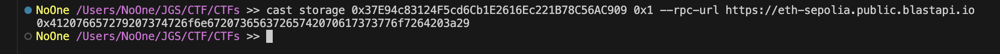
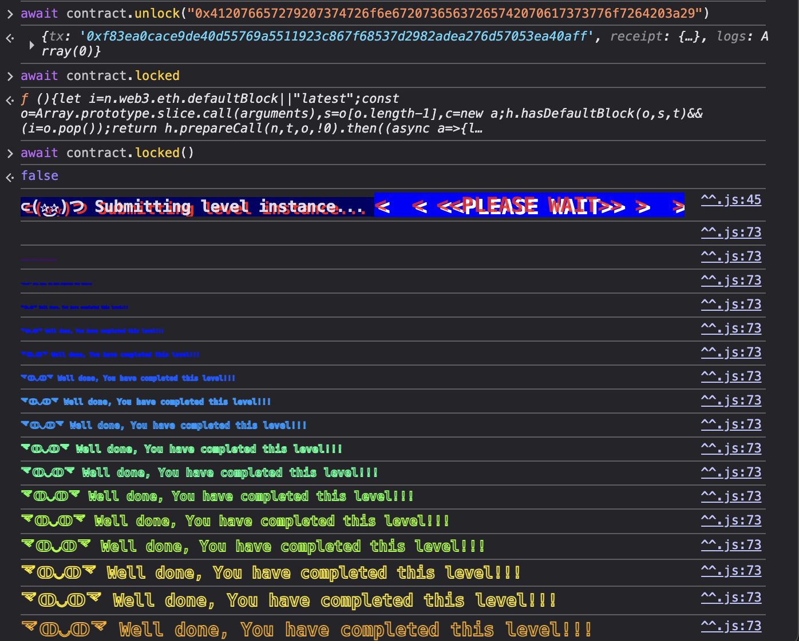

# Vault #

### Challange ###

Unlock the vault to pass the level!

### Contract ###




### Solution ####

To solve this, we need to read the onchain data from the password variable within the contract. Even though the password has 'private' visibility, the data can still be read since it still stored on the blockchain. To do this, we can use foundry cast to check for the data in deployed contract.

```cast storage [DEPLOYED CONTRACT ADDRESS] [STORAGE SLOT] --rpc-url [RPC URL]```



We use 0x1 as the slot storage because the password parameter is declared second, considering that the first place is getting the 0x0 slot. After getting the bytes32 password, we can submit it using the unlock function as can be seen in the following picture.

