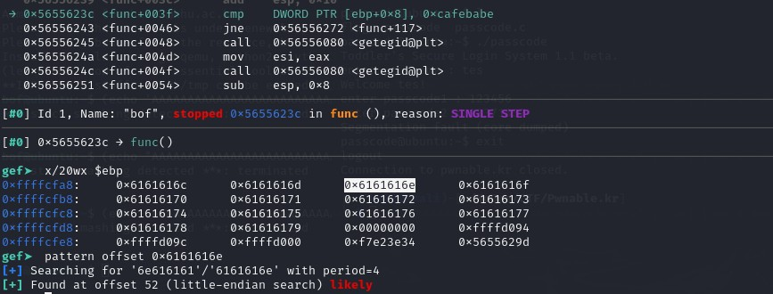
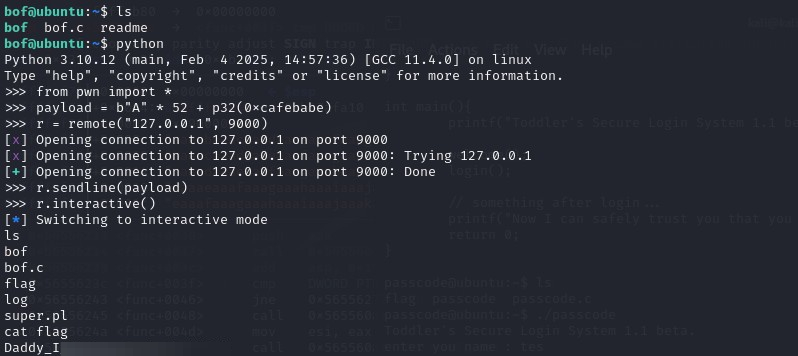

#  BOF #

### Challange ###

bof binary is running at "nc 0 9000" under bof_pwn privilege. get shell and read flag

```
#include <stdio.h>
#include <string.h>
#include <stdlib.h>
void func(int key){
        char overflowme[32];
        printf("overflow me : ");
        gets(overflowme);       // smash me!
        if(key == 0xcafebabe){
                setregid(getegid(), getegid());
                system("/bin/sh");
        }
        else{
                printf("Nah..\n");
        }
}
int main(int argc, char* argv[]){
        func(0xdeadbeef);
        return 0;
}

```

### Solution

This one I had to peek a little bit since the nx bit is enabled and it confused me. First, we see that the program use gets function to user input and vulnerable to buffer overflow. Next, we must find a way to overflow the key where its initially set to 0xdeadbeef, but first we must find its location within the program.

For this we can check the compare instruction and use the pattern cyclic to find the offset:



We found that the offset to key parameter (ebp+0x8) is 52 bit (13 byte).

For this we could simply use echo for the 52 bit prefix and the 0xcafebabe, but somehow I got stack smashing error since the nx bit is enabled, even though the shell should be initiated before the program return to main. So for this we can use pwntools for the interactive shell.

