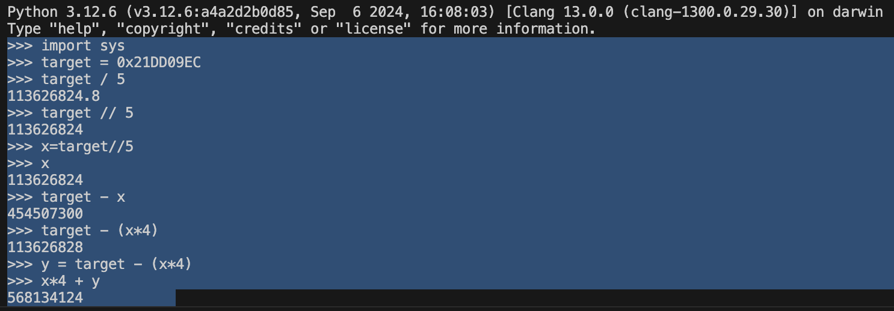
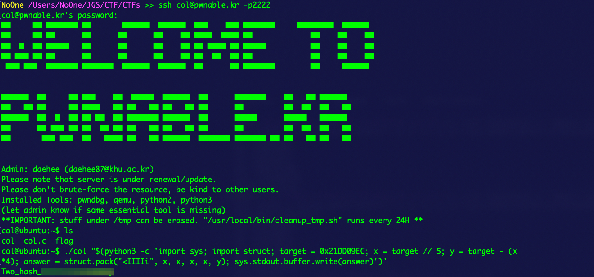

## col ##

Challange:

```
#include <stdio.h>
#include <string.h>
unsigned long hashcode = 0x21DD09EC;
unsigned long check_password(const char* p){
	int* ip = (int*)p;
	int i;
	int res=0;
	for(i=0; i<5; i++){
		res += ip[i];
	}
	return res;
}

int main(int argc, char* argv[]){
	if(argc<2){
		printf("usage : %s [passcode]\n", argv[0]);
		return 0;
	}
	if(strlen(argv[1]) != 20){
		printf("passcode length should be 20 bytes\n");
		return 0;
	}

	if(hashcode == check_password( argv[1] )){
		setregid(getegid(), getegid());
		system("/bin/cat flag");
		return 0;
	}
	else
		printf("wrong passcode.\n");
	return 0;
}
```

Solution:

Since the program takes 20 bytes characters, and split it into 5 indexes (4 bytes each index), we must found 5 strings sequence that resulted 0x21DD09EC. We can solve this by dividing the target by 5, and for the 5th index we substract the target value with the divided result times 4 (since we want the 5th index equal to whatever number that resulted in the target number).

We basically can do it this way:

    target = 0x21DD09EC (This is equal to 568134124)

    x = target // 4 (We floor down the result so we don't get float)

    y = taget - (x * 4)

    Final Result = x, x, x, x, y



We can use command subtitution to supply the bytes string to the program.

