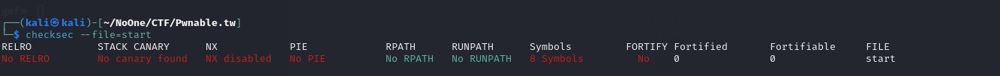
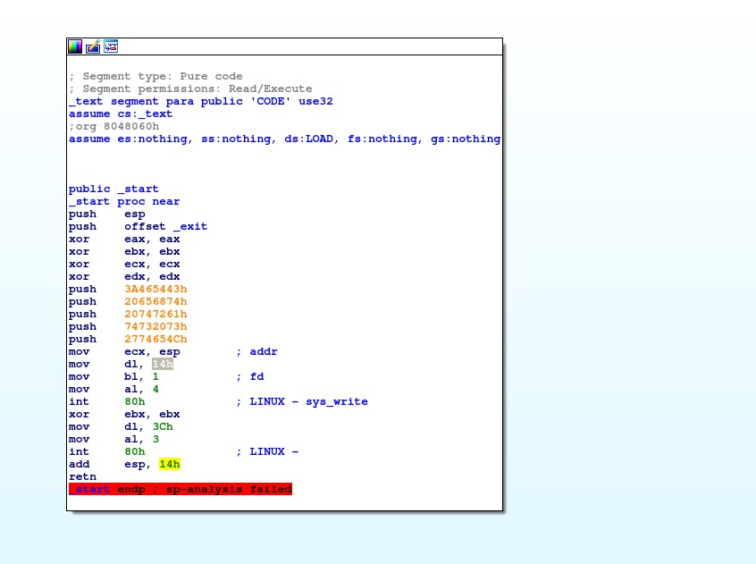
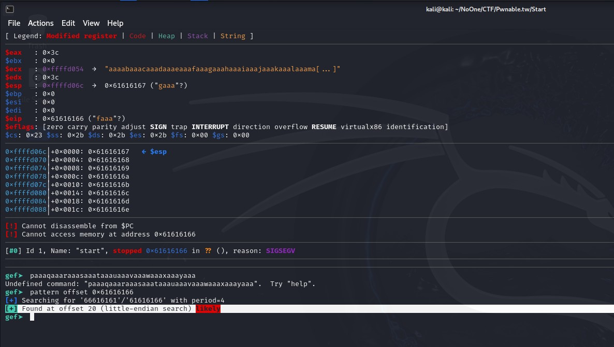
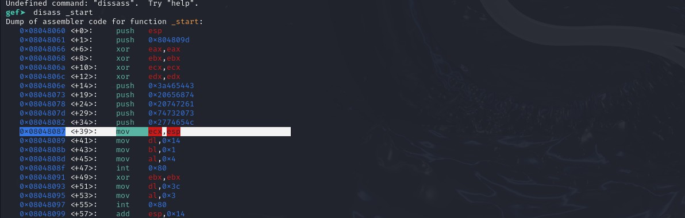
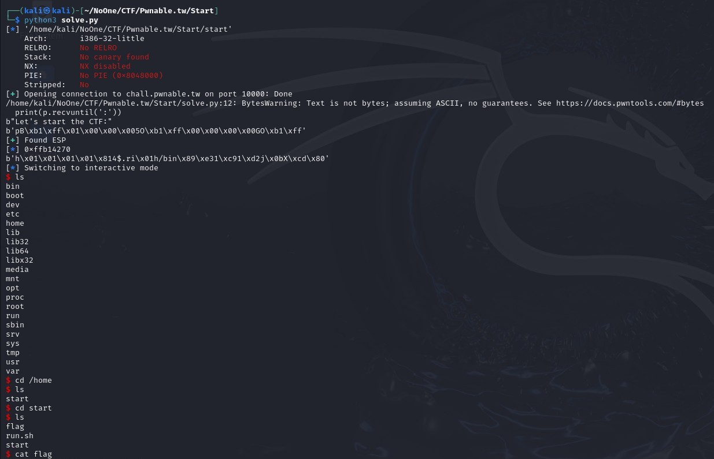

# Start

### Type: PWN Linux ix86

**I'm a bit rusty (or just a noob on linux pwn for now), so this took me hours and a bit of peeking.**

There is no protection for the binary:

This is a pretty simple program, below is the disassembly result using IDA:

There are two syscalls, read() and write(). The write use 20 bytes for printing hardcoded string at the beginning and the read is reading 60 bytes from stdin. The read has no check and vulnerable to buffer overflow.

The offset to EIP is 20 bytes. But I see that we have little space for the shellcode.
This is basically the step on how we obtain execution:

1. Prefix 20 bytes
2. Use the static address of mov ecx, esp as the EIP address (bytes 20-24) to leak the ESP
3. How we leak ESP? Its because the write function above, so we go back to the function again and run the write but this time we write the ESP address in ECX
4. For what we leak it? To jump to our shellcode, we can hardcoded it if ASLR is turned off, otherwise its dynamic and we must leak it.

5. After that use a small shellcode from pwntools to get shell.
6. Basically we use two payloads: 
    a) 20 Bytes Prefix + mov ecx, esp address -> To leak ESP
    b) 20 Bytes Prefix + Leaked ESP address from step above + Our shellcode

We craft the exploit and run it:

